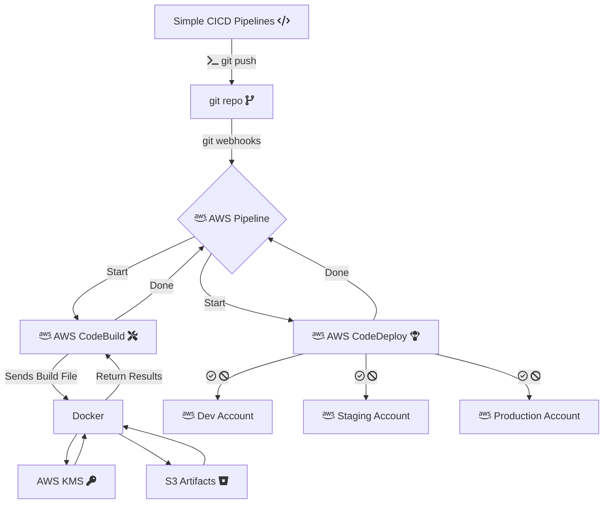

# demo-aws-cdk
AWS Demo deployment using the AWS CDK and AWS Pipelines

## AWS Pipelines with CDK Typescript

A serverless CI/CD platform leveraging native AWS services provisioned using the AWS Cloud Development Kit (CDK). As per the AWS Well Architected Framework, this project assumes the use of multiple AWS accounts for secure isolation of environments.

`Flowchart -` https://marketplace.visualstudio.com/items?itemName=bierner.markdown-mermaid

## Defining your environment & projects

Add a project to the project-config.json file in the root of the Pipeline project & push to S3.
Add your build, test, and deploy scripts in the root of the project repo
Deploy Project by committing to the main branch (or feature branch as configured)
### AWS CDK

Invoke the CDK `cdk init app --language typescript`

Create buckets
### AWS services

- AWS CodeCommit (or any source control provider supported by CodePipeline)
- AWS CodePipeline
- AWS CodeBuild
- AWS Lambda
- AWS S3
- AWS SNS
- AWS CloudWatch
- AWS Systems Manager: Parameter Store
- AWS CloudFormation
